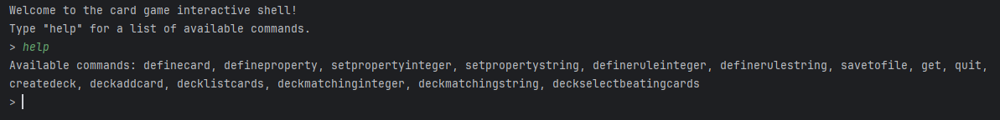
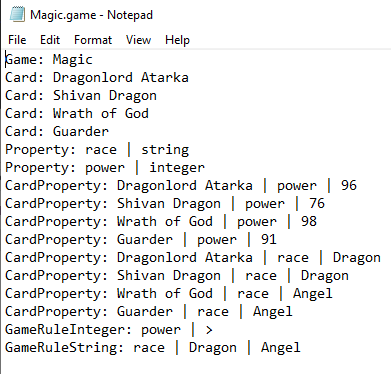

# Card Game Engine

This project was originally created as a university assignment inside a Gradle project with unit tests. The project is rebuilt in 2025 as a way to refresh and practice my Java skills — this time kept simpler, without Gradle or tests.

## What is it?

The Card Game Engine lets you define your own **Game** by

- **Create Cards** (e.g., Lord of Dragons, Death Knight)
- **Create Properties** (e.g., `power` as an integer property, `race` as a string property).
- **Assign values** to those properties per card (e.g.,
  _Lord of Dragons_ → `power = 98`, `race = Dragon`; _Death Knight_ → `power = 94`, `race = Undead`).

- **Define rules**:
  - Integer rules (`power: >` → higher power wins).
  - String rules (`Undead wins against Dragon` → Undead beats Dragon).
- **Create decks**, add cards into them, and test battles between cards.
- A card **wins against another** if it wins **more rules** than the opponent.

**Example**:

Lord of Dragons (power=98, race=Dragon)
Death Knight (power=94, race=Undead)

Rules:

- power: >

- race: Undead wins against Dragon

Comparison:

Power: Lord of Dragons wins (98 > 94)

Race: Death Knight wins (Undead beats Dragon)

Result: **Draw** (each card wins 1 rule)

**Save your game**

You can also save your game and reuse it later.  
Saved games are stored in the `games/` folder.

Example of a saved game file (`Magic.game`):

## How to Try It

1. Clone the repository or download the project
2. Compile all files inside the src folder
3. Run the Main class
